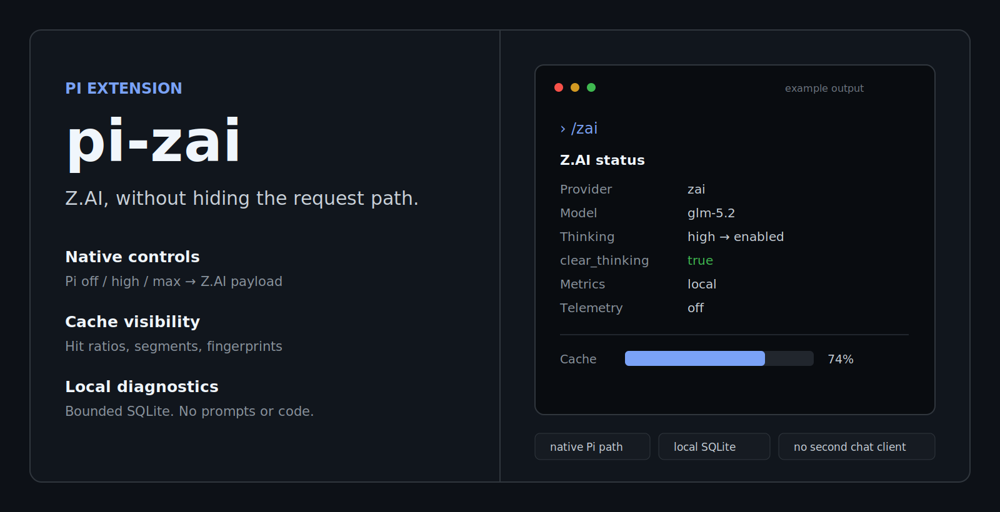
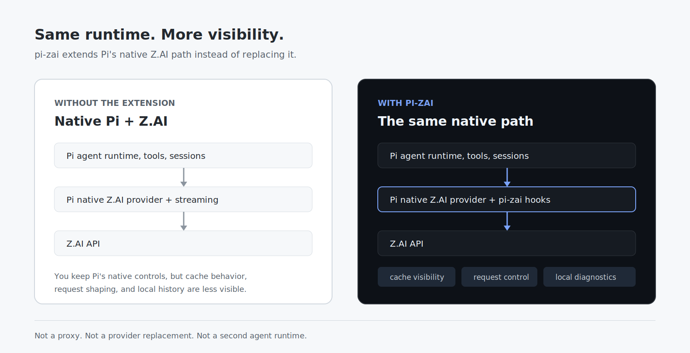
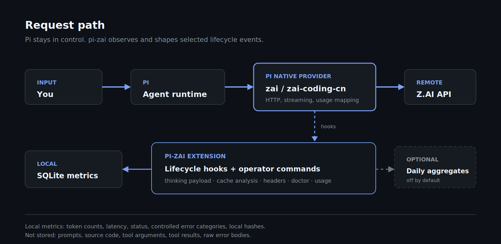

<p align="center">
  
</p>

<p align="center">
  <a href="https://www.npmjs.com/package/@onlinechefgroep/pi-zai"></a>
  
  
  <a href="LICENSE"></a>
</p>

# pi-zai

A Pi extension for running Z.AI with visible cache behavior, native thinking controls, and local operator diagnostics.

Pi already owns the agent loop, tools, sessions, streaming, and Z.AI provider. **pi-zai hooks into that existing path.** It does not proxy chat traffic, replace Pi's runtime, or create a second model client.

## Install

```bash
pi install npm:@onlinechefgroep/pi-zai
```

Reload Pi, select a Z.AI model, and open the status view:

```text
/reload
/zai
```

Credentials stay in Pi's normal credential flow: `/login`, `auth.json`, `models.json`, or `ZAI_API_KEY`.

[Getting started →](docs/getting-started.md)

## What changes when the extension is loaded

<p align="center">
  
</p>

| Area | Native Pi + Z.AI | With pi-zai |
|---|---|---|
| Agent runtime | Pi | Still Pi |
| Provider and streaming | Pi's native Z.AI provider | Still Pi's native provider |
| Thinking UI | Pi `off` / `high` / `max` | Mapped to the Z.AI request payload |
| Cache visibility | Usage fields are available internally | Hit ratios, segment fingerprints, and recommendations |
| Diagnostics | General provider errors | `/zai-doctor`, transport summaries, retry guidance |
| Usage | Per-response usage | Session totals, Coding Plan quota, Platform estimates |
| History | Session-scoped | Privacy-reduced local SQLite metrics |

## Operator commands

| Command | Purpose |
|---|---|
| `/zai` | Provider, endpoint, model, thinking payload, cache, throughput, tools, and session usage |
| `/zai-cache` | Cache hit ratios, prompt segments, fingerprints, and recommendations |
| `/zai-usage` | Session token totals, Coding Plan quota, or Platform cost estimates |
| `/zai-doctor` | Integration checks and optional connectivity/stability probes |
| `/zai-transport` | Local latency and controlled error-category summaries |
| `/zai-data` | Inspect, export, vacuum, or wipe local metrics |
| `/zai-privacy preview` | Show exactly what is stored locally and what could be aggregated |
| `/zai-benchmark` | Track A0–A3 cache-strategy experiments |

[Full command reference →](docs/commands.md)

## Native thinking, explicit request behavior

pi-zai uses Pi's own thinking selector. There is no second `/zai-thinking` state to keep in sync.

For GLM-5.2, Pi's visible levels are translated in `before_provider_request`:

```text
Pi off   → thinking disabled
Pi high  → thinking enabled, reasoning_effort high
Pi max   → thinking enabled, reasoning_effort max
```

Historical reasoning is not replayed by default: `clear_thinking=true`. Preserving earlier reasoning remains an explicit advanced opt-in.

[Thinking details →](docs/thinking.md)

## Architecture

<p align="center">
  
</p>

The chat request still follows the normal Pi route:

```text
You → Pi agent runtime → Pi native Z.AI provider → Z.AI API
```

pi-zai adds lifecycle hooks for request shaping, cache analysis, headers, diagnostics, and local metrics. It does not upload prompts or completions through a separate service.

[Architecture →](docs/architecture.md)

## Local by default

Local metrics are enabled by default and stored under Pi's user directory:

```text
~/.pi/agent/state/pi-zai/metrics.sqlite3
~/.pi/agent/state/pi-zai/local.secret
```

Stored fields are limited to operational data such as token counts, latency, HTTP status, controlled error categories, local hashes, and short fingerprints. **Prompt text, source code, tool arguments, tool results, and raw error bodies are not stored.**

Retention is bounded and the data can be removed from Pi:

```text
/zai-data clear-project
/zai-data clear-details
/zai-data clear-all
```

Anonymous aggregate telemetry exists as an opt-in path and is off by default. It requires both configuration and explicit consent.

[Security and privacy →](docs/security.md)

## Essential configuration

```json
{
  "zai": {
    "preserveThinking": false,
    "sessionAffinity": "off",
    "promptStability": { "mode": "observe" },
    "metrics": { "mode": "local" },
    "telemetry": { "mode": "off" }
  }
}
```

| Setting | Default | Meaning |
|---|---:|---|
| `preserveThinking` | `false` | Keep `clear_thinking=true` unless explicitly changed |
| `metrics.mode` | `local` | `off`, in-memory, or bounded SQLite storage |
| `promptStability.mode` | `observe` | Measure stable and volatile prompt sections without rewriting |
| `sessionAffinity` | `off` | Experimental `X-Session-Id` support when enabled |
| `telemetry.mode` | `off` | No remote aggregate uploads |

[Configuration reference →](docs/configuration.md)

## Endpoints

| Provider | Route | Billing |
|---|---|---|
| `zai` | `api.z.ai/.../coding/paas/v4` | Coding Plan |
| `zai-coding-cn` | `open.bigmodel.cn/.../coding/paas/v4` | Coding Plan (China) |
| `zai-platform` | `api.z.ai/.../paas/v4` | Metered Platform API |

pi-zai does not override Pi's built-in `zai` or `zai-coding-cn` providers. Register `zai-platform` in `models.json` only when you need the metered endpoint.

## Documentation

- [Getting started](docs/getting-started.md)
- [Architecture](docs/architecture.md)
- [Cache optimization](docs/cache-optimization.md)
- [Thinking](docs/thinking.md)
- [Commands](docs/commands.md)
- [Configuration](docs/configuration.md)
- [Security and privacy](docs/security.md)
- [Troubleshooting](docs/troubleshooting.md)
- [Development](docs/development.md)

## Development

```bash
npm install
npm run build
npm test
npm run lint
```

The extension targets Pi `>= 0.80.0` and Node.js `>= 22.19.0`.

## License

MIT — see [LICENSE](LICENSE).
